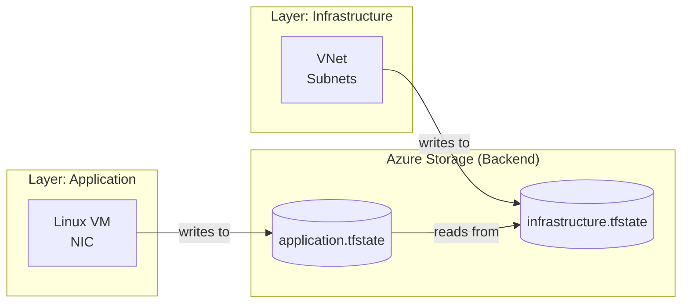

# Lab 1: Remote State & Layered Terraform Architecture

## 1. Learning Objectives
You will learn to:
- Separate platform (network) & workload (application) concerns with independent state
- Use partial backend configuration via `.tfbackend` files for portability
- Chain layers safely using `terraform_remote_state`
- Enforce least privilege & blast-radius reduction through state scoping
- Introduce reproducible preparation (idempotent bootstrap script)
- Prepare for future multi-environment expansion (naming, variables)

## 2. Why Layer & Split State?
| Concern | Single State (Monolith) | Layered States (This Lab) | Benefit |
|---------|------------------------|---------------------------|---------|
| Blast Radius | Any apply can impact all resources | Each layer isolated | Safer changes |
| Parallel Work | Serialized team edits | Independent applies | Higher velocity |
| Access Control | Broad permissions needed | Per-layer RBAC | Least privilege |
| Drift Detection | Hard to localize | Granular diffs | Faster MTTR |
| Promotion Strategy | All-or-nothing | Promote infra before app | Controlled rollout |

## 3. Architecture Overview


## 4. Backend Strategy
Pattern:
- Terraform blocks specify only stable, non-secret backend keys (`container_name`, `use_azuread_auth`) while dynamic values live in `.tfbackend` files.
- Preparation script generates storage resources + backend files (idempotent).
- AzureAD auth avoids persisted access keys.

Flow:
1. Bootstrap storage (script) → produce `*.tfbackend`
2. `terraform init -backend-config=<file>` per layer
3. Each layer manages its own lock & history (blob versioning recommended)

## 5. Repository Layout (Lab Scope)
| Path | Purpose |
|------|---------|
| `infrastructure/` | Network foundation: RG, VNet, subnets |
| `application/` | VM & NIC referencing infra outputs |
| `infrastructure/infrastructure.tfbackend` | Backend config for infra layer |
| `application/application.tfbackend` | Backend config for app layer |
| `application/data.tf` | Remote state data source config |
| `prepare.sh` | Idempotent storage + files bootstrap |

## 6. Environment Preparation
```bash
cd solutions/lab1
az login  # Ensure Azure CLI auth
export ARM_SUBSCRIPTION_ID=<your-subscription-id>
chmod +x prepare.sh
./prepare.sh
cd infrastructure && terraform init -backend-config=infrastructure.tfbackend
terraform plan
terraform apply
cd ../application && terraform init -backend-config=application.tfbackend
terraform plan
terraform apply
```
# Optional overrides
# RESOURCE_GROUP=my-tf-rg LOCATION=westeurope ./prepare.sh
# Default location variable used by both layers
# echo $TF_VAR_location  # set externally if desired
```
Outputs: resource group, storage account, two `.tfbackend` files, tfvars for application.

## 7. Infrastructure Layer Workflow
| Step | Command | Purpose |
|------|---------|---------|
| Init | `terraform init -backend-config=infrastructure.tfbackend` | Bind remote backend |
| Plan | `terraform plan` | Preview network resources |
| Apply | `terraform apply -auto-approve` | Create RG, VNet, subnets |
| Outputs | `terraform output` | IDs passed to next layer |

Key outputs: `vnet_id`, `subnet_ids`.

## 8. Application Layer Workflow
| Step | Command | Purpose |
|------|---------|---------|
| Init | `terraform init -backend-config=application.tfbackend` | Attach backend |
| Refresh | `terraform refresh` | Confirm remote state reachable |
| Plan | `terraform plan` | VM + NIC referencing infra outputs |
| Apply | `terraform apply -auto-approve` | Provision compute |
| Outputs | `terraform output` | SSH command, resource info |

## 9. Cross-Layer Data Access
Remote state data source (simplified):
```hcl
data "terraform_remote_state" "network" {
  backend = "azurerm"
  config = {
    resource_group_name  = var.backend_resource_group_name
    storage_account_name = var.backend_storage_account_name
    container_name       = var.backend_container_name
    key                  = "infrastructure.tfstate"
    use_azuread_auth     = true
  }
}
```
Used in application layer to map subnet & vnet ids.

## 10. Verification Checklist
| Area | Action / Command | Expected |
|------|------------------|----------|
| Backend Files | `ls infrastructure/*.tfbackend application/*.tfbackend` | Two tfbackend files |
| Infra State Blob | `az storage blob list --container-name tfstate` | `infrastructure.tfstate` present |
| App State Blob | Same as above | `application.tfstate` present |
| Infra Outputs | `cd infrastructure && terraform output` | VNet + subnet map |
| Data Source | `cd ../application && terraform console` | `data.terraform_remote_state.network.outputs` map |
| VM Exists | `az vm show -d -g <RG> -n <name>` | PowerState running |

## 11. Troubleshooting Matrix
| Symptom | Likely Cause | Fix |
|---------|--------------|-----|
| Init asks for backend values | Missing `-backend-config` | Supply `.tfbackend` file each init |
| App plan: subnet not found | Infra layer not applied yet | Apply infra then re-run plan |
| Authentication errors | Azure CLI not logged in | `az login` then retry |
| Wrong resource group derived | Regex fragile in NIC RG extraction | Expose RG as explicit output instead |
| VM password in code flagged | Hardcoded demo password | Replace with Key Vault & `admin_ssh_key` |
| State blob not found | Different storage account name | Re-run `prepare.sh` or sync tfvars |

## 12. Hardening & Extensions
| Goal | Improvement | Notes |
|------|------------|-------|
| Secrets Hygiene | Remove plaintext password; use SSH keys or Key Vault data source | Align with future security labs |
| Explicit Outputs | Output RG name separately | Avoid regex parsing of IDs |
| Tagging Strategy | Add common tags per layer | Standardize cost & ownership |
| Additional Layers | Add `security`, `database` states | Each with own backend key |
| CI Integration | Add GitHub Actions: fmt → validate → plan | Mirror Lab 4 pipeline idioms |
| Drift Detection | Scheduled `terraform plan -detailed-exitcode` | Non-zero exit for drift |
| Locking Visibility | Enable blob soft delete & versioning | Faster recovery |

## 13. Cleanup Sequence
Always tear down dependent layer first.
```bash
# Application layer
cd application
terraform destroy -auto-approve
# Infrastructure layer
cd ../infrastructure
terraform destroy -auto-approve
# Optionally remove state storage (irreversible)
RESOURCE_GROUP=$(grep resource_group_name infrastructure.tfbackend | cut -d'"' -f2)
az group delete --name $RESOURCE_GROUP --yes --no-wait
```

## 14. Review Questions
1. What guarantees isolation between layers and reduces blast radius?  
2. When would you merge two layers back into a single state?  
3. How would you introduce environment (dev/stage/prod) without duplicating code?  
4. What risks arise from parsing a resource group name via regex, and how to mitigate?  
5. Which metrics/logs would you forward first once monitoring is added?  

## 15. Next Lab Bridge
Continue to Lab 2 to expand platform scale: multi-subscription landing zone & governance baseline building upon remote state practices here.

## 16. References
- Terraform Backends: https://developer.hashicorp.com/terraform/language/settings/backends/configuration
- AzureRM Backend Docs: https://developer.hashicorp.com/terraform/language/settings/backends/azurerm
- Remote State Data Source: https://developer.hashicorp.com/terraform/language/state/remote-state-data
- State Locking: https://developer.hashicorp.com/terraform/language/state/locking
- Azure Blob Versioning: https://learn.microsoft.com/azure/storage/blobs/versioning-overview
- Separation of State Guidance: https://developer.hashicorp.com/terraform/cloud-docs/guides/recommended-practices/part1


