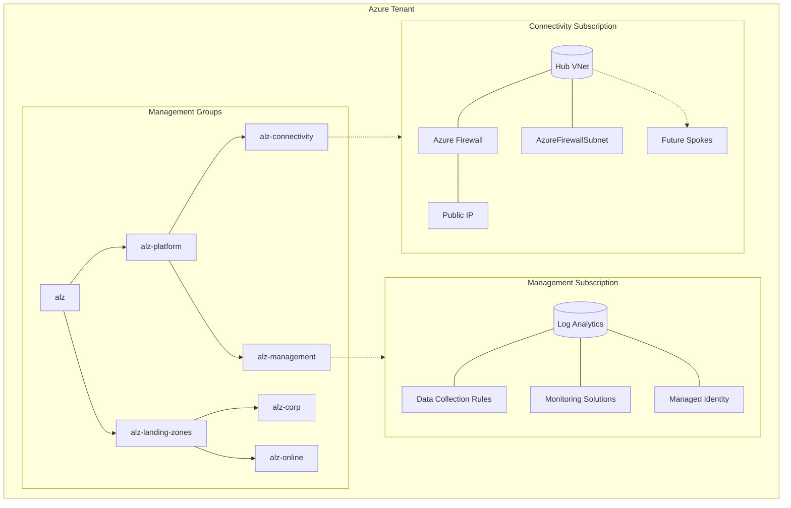

# Lab 2: Enterprise Landing Zone Foundation (Azure Verified Modules + ALZ)

## 1. Learning Objectives
By the end you can:
- Map governance requirements to an Azure management group hierarchy
- Deploy multi-subscription resources using provider aliases safely
- Compose Azure Verified Modules (AVM) + ALZ provider for policy & platform
- Explain hub & spoke / platform vs landing zone separation
- Validate governance (policies, RBAC) and networking deployment
- Plan next-step production hardening (remote state, CI/OIDC, version pinning)

## 2. Conceptual Overview
This lab stands up a minimal but production-aligned Landing Zone baseline using:
- Management group scaffold (corp / online separation under platform + landing zones)
- Central logging & monitoring (Log Analytics, DCRs, solutions) in the management subscription
- Hub virtual network + firewall foundation in a dedicated connectivity subscription
- Azure Policies + (optionally) custom roles via ALZ provider modules
- Cross-subscription orchestration from one Terraform root using provider aliases

## 3. Architecture Diagram


## 4. Module & Component Matrix
| Module / Block | Scope | Subscription | Purpose | Notes |
|----------------|-------|--------------|---------|-------|
| `alz_core` | Management Groups | Tenant Root | Hierarchy + Policies | Via ALZ provider & AVM refs |
| `management` | Resource Groups, Log Analytics, DCR | Management | Central logging/monitor | Future: Sentinel, cost mgmt |
| `hub_network` | VNet, Firewall, Subnets | Connectivity | Network hub foundation | Future: DNS, Bastion, Private Resolver |
| Provider aliases | N/A | Multi | Direct cross-subscription create | Each module bound explicitly |

## 5. Provider & Authentication Strategy
Pattern:
- Default `azurerm` = management subscription
- `alias = "connectivity"` for hub networking
- `alz` provider to pull enterprise policy/library constructs
- Auth uses Azure CLI (interactive). For CI/CD move to OIDC Federated Identity + minimal custom role.

Risk controls:
- Explicit provider blocks passed into modules (avoid implicit default leakage)
- Version pinning (`>=` vs `~>` for modules) — move to `~>` for stability in prod
- (Future) Use `terraform.lock.hcl` checked into VCS for plugin immutability

## 6. Environment Preparation
```bash
export MGMT_SUB_ID="<management-sub-id>"
export CONN_SUB_ID="<connectivity-sub-id>"
export TF_VAR_location="southeastasia"

az account set --subscription "$MGMT_SUB_ID"
az account show -o table
```
Register resource providers (idempotent):
```bash
for p in Microsoft.PolicyInsights Microsoft.Authorization Microsoft.Management \
         Microsoft.Network Microsoft.OperationalInsights Microsoft.Insights \
         Microsoft.ManagedIdentity; do
  az provider register --namespace $p --wait
done
```

## 7. Terraform Workflow
| Phase | Command | Purpose | Key Output Checks |
|-------|---------|---------|-------------------|
| Init | `terraform init` | Download providers & modules | `Initializing provider plugins` lines |
| Validate | `terraform validate` | Syntax & provider config sanity | Exit code 0 |
| Plan | `terraform plan -var=management_subscription_id=$MGMT_SUB_ID -var=connectivity_subscription_id=$CONN_SUB_ID` | Execution preview | Count (~400 resources) |
| Apply | `terraform apply ...` | Provision infra | Creation sequence logs |
| Post Verify | Custom az CLI checks | Governance & network present | MG tree, policies, VNet |

Minimal command bundle:
```bash
terraform init
terraform validate
terraform plan \
  -var=management_subscription_id=$MGMT_SUB_ID \
  -var=connectivity_subscription_id=$CONN_SUB_ID
terraform apply \
  -var=management_subscription_id=$MGMT_SUB_ID \
  -var=connectivity_subscription_id=$CONN_SUB_ID
```

## 8. Verification Checklist
| Area | Command / Action | Expected |
|------|------------------|----------|
| Management Groups | `az account management-group list -o table` | Hierarchy with alz-* groups |
| Policies | `az policy assignment list --scope /providers/Microsoft.Management/managementGroups/alz -o table` | Multiple assignments present |
| Log Analytics | `az monitor log-analytics workspace show --resource-group rg-alz-management --workspace-name law-alz-management --subscription $MGMT_SUB_ID` | Provisioned workspace JSON |
| Hub VNet | `az network vnet show --name vnet-hub-primary --resource-group rg-hub-networking --subscription $CONN_SUB_ID` | Address space + subnets |
| Firewall | Portal / `az network firewall show` | Firewall with public IP |
| DCR | Portal or `az resource list --name *DataCollectionRule*` | Rules targeting workspace |

## 9. Observability & Governance Notes
- Central logging ready for future ingestion (VM insights, Container insights)
- Policies may take several minutes to reflect compliance states
- Role definitions (if any) might require re-auth to pick up permissions

## 10. Troubleshooting Matrix
| Symptom | Likely Cause | Resolution |
|---------|--------------|-----------|
| Plan errors: provider alias not found | Module missing explicit `providers` map | Add `providers = { azurerm = azurerm, azurerm.connectivity = azurerm.connectivity }` |
| Policies not created | Insufficient tenant root permissions | Ensure User Access Administrator / Owner at root MG |
| Firewall missing | Connectivity subscription not set | Confirm `CONN_SUB_ID` and plan again |
| Log Analytics missing solution add-ons | Module version mismatch | Check module version, run `terraform providers lock` |
| Slow apply ( >30m ) | Provider registration pending | Run provider registration loop & re-apply |
| Stale policy compliance | Evaluation delay | Wait 15–30 min, or trigger scan via portal |

## 11. Scaling & Extension Ideas
| Goal | Enhancement | Pointer |
|------|-------------|---------|
| Remote State | Azure Storage backend w/ state locking | Add `backend "azurerm"` block |
| CI Pipeline | GitHub Actions OIDC plan/apply gates | Reuse patterns from Lab 4 |
| Cost Mgmt | Add budget + alerts module | AVM cost mgmt modules / native ARM |
| Security | Add Sentinel + Defender for Cloud enablement | Additional AVMs / policy assignments |
| Network Expansion | Spoke VNets & peering automation | New module referencing hub outputs |
| Policy Lifecycle | Canary -> Audit -> Deny path | Mirror patterns from Lab 3 |
| Secrets | Key Vault + RBAC integration | Dedicated mgmt module step |

## 12. Cleanup
```bash
terraform destroy \
  -var=management_subscription_id=$MGMT_SUB_ID \
  -var=connectivity_subscription_id=$CONN_SUB_ID
```
Confirm with `yes`. Note: Management group deletions may require manual policy detach if custom changes were made.

## 13. Review Questions
1. Which safeguards prevent accidental deployment into the wrong subscription?  
2. How would you introduce remote state without leaking credentials?  
3. What triggers a full replacement vs in-place update for the hub VNet?  
4. How do you stage policy rollouts to avoid tenant-wide disruption?  
5. When would you split additional subscriptions (e.g., identity, security)?  

## 14. Next Lab Bridge
Proceed to Lab 3 (Governance & Policy as Code) to deepen policy lifecycle, remediation, and compliance automation using the foundation created here.

## 15. References
- Azure Landing Zones: https://learn.microsoft.com/azure/cloud-adoption-framework/ready/landing-zone/
- Azure Verified Modules: https://azure.github.io/Azure-Verified-Modules/
- ALZ Provider Registry: https://registry.terraform.io/providers/Azure/alz/latest/docs
- Terraform Provider Aliases: https://developer.hashicorp.com/terraform/language/providers/configuration#alias-multiple-provider-configurations
- Azure Policy: https://learn.microsoft.com/azure/governance/policy/
- Management Groups: https://learn.microsoft.com/azure/governance/management-groups/
- Terraform CLI Docs: https://developer.hashicorp.com/terraform/cli
