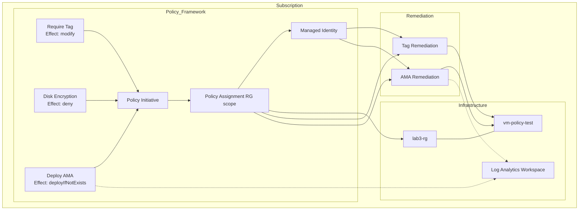

## Lab 3 – Advanced Azure Policy as Code & Remediation

Define custom Azure Policies + initiative, assign them with least-privilege identity at RG scope, trigger modify / deny / deployIfNotExists effects, and observe remediation lifecycle using Terraform + AzAPI.

---

## 1. Learning Objectives
* Author custom modify, deny, deployIfNotExists policies
* Bundle policies into a reusable initiative (set definition)
* Assign at minimal scope (resource group) with System Assigned Managed Identity
* Grant least privilege for remediation (targeted role assignments)
* Orchestrate remediation tasks (tag + AMA) via AzAPI where needed
* Safely validate, observe compliance states, and roll back

## 2. Architecture & Flow


Flow legend:
1. Definitions created → initiative → assignment
2. Assignment identity granted roles
3. Evaluation runs, non-compliance detected
4. Modify adds tags, deployIfNotExists deploys AMA, deny blocks insecure changes
5. Remediation tasks track progress

## 3. Policy Component Matrix
| Ref | Name (Display) | Effect | Trigger Condition (Simplified) | Action / Outcome | Remediation Mode |
|-----|----------------|--------|--------------------------------|------------------|------------------|
| PD1 | Require Tag | modify | Resource missing required tag | Tag inserted via modify operation | Automatic |
| PD2 | Enforce Disk Encryption | deny | OS disk not encrypted per policy rules | Deployment blocked | Preventive |
| PD3 | Deploy AMA | deployIfNotExists | VM missing AMA extension | AMA extension deployed | Corrective |

## 4. Identity & Access Model
| Identity | Role | Scope | Purpose |
|----------|------|-------|---------|
| Assignment System MI | Contributor | RG | Create extensions / remediate tags |
| Assignment System MI | Virtual Machine Contributor | RG | Operate VM extension deployment with reduced privileges |

Principle: start with narrowest scope (RG) then elevate cautiously (MG/Subscription) after validation.

## 5. Prerequisites
| Requirement | Detail |
|-------------|--------|
| Azure Roles | Policy Contributor (or Owner) + ability to assign roles at RG |
| CLI | Azure CLI ≥ 2.50, logged in (`az account show`) |
| Terraform | ≥ 1.7 |
| Tools | jq, bash |
| Password | Strong admin password or `TF_VAR_vm_admin_password` exported |
| Providers Registered | Microsoft.PolicyInsights, Authorization, Compute, Network, OperationalInsights, Insights, ManagedIdentity |

Bootstrap (optional):
```bash
cd solutions/lab3
chmod +x prepare.sh
./prepare.sh
```

## 6. Variable & Input Strategy
Override defaults by creating `terraform.tfvars`:
```hcl
location            = "southeastasia"
resource_group_name = "lab3-rg"
tag_name            = "cost-center"
tag_value           = "lab3"
vm_admin_username   = "azureuser"
vm_admin_password   = "ChangeM3!" # or export TF_VAR_vm_admin_password
# log_analytics_workspace_id = "/subscriptions/<sub>/resourceGroups/<rg>/providers/Microsoft.OperationalInsights/workspaces/<name>"
```
If no workspace ID provided, one is created automatically.

## 7. Deployment Phases
| Phase | Command / Action | Goal | Key Notes |
|-------|------------------|------|-----------|
| 1 | `terraform init` | Provider setup | AzureRM + AzAPI |
| 2 | `terraform plan` | Preview resources | Ensure definitions correct |
| 3 | `terraform apply -auto-approve` | Create & assign policies | Evaluation may take minutes |
| 4 | Manual CLI checks | Validate assignment & MI | Confirm roles, identity principalId |
| 5 | Trigger non-compliance | Observe modify/deny/deployIfNotExists | Create extra VM / NSG |
| 6 | Optional remediation run | Force remediation if needed | `az policy remediation create` |

Visit this [link](https://portal.azure.com/#view/Microsoft_Azure_Policy/PolicyMenuBlade/~/Overview) to monitor compliance states.

## 8. Verification Commands (Grouped)
```bash
terraform output
RG=$(terraform output -raw test_resource_group_name)
az policy assignment list --resource-group "$RG" -o table | grep enterprise-governance-assignment || true
az policy definition list --query "[?policyType=='Custom' && (contains(name,'require-') || contains(name,'deploy-ama'))]" -o table
ASSIGN_ID=$(terraform output -raw policy_assignment_id)
PRINCIPAL_ID=$(az policy assignment show --name enterprise-governance-assignment --resource-group "$RG" --query identity.principalId -o tsv)
az role assignment list --assignee "$PRINCIPAL_ID" --scope $(az group show -n "$RG" --query id -o tsv) -o table
az policy remediation list --resource-group "$RG" -o table
az policy state list --resource-group "$RG" --top 20 -o table
az vm show --name vm-policy-test --resource-group $RG --query tags
az vm extension list --vm-name vm-policy-test --resource-group $RG --query "[?name=='AzureMonitorLinuxAgent']"
OSDISK_ID=$(az vm show --name vm-policy-test --resource-group $RG --query "storageProfile.osDisk.managedDisk.id" -o tsv)
az disk show --ids $OSDISK_ID --query "encryption.type"
```

## 9. Testing Policy Effects
Create additional non-compliant resources:
```bash
RG=$(terraform output -raw test_resource_group_name)
az network nsg create -g $RG -n nsg-extra-test --tags Purpose=AdHoc
az vm create \
  --resource-group $RG \
  --name vm-extra-test \
  --image Ubuntu2204 \
  --admin-username azureuser \
  --generate-ssh-keys \
  --size Standard_B1s \
  --tags Purpose=AdHoc
```
Expected:
* Tag policy modifies (inserts required tag) where missing
* Disk encryption policy denies non-compliant creation attempts
* AMA policy deploys extension automatically for managed VM

## 10. Manual Remediation (Optional)
```bash
ASSIGN_ID=$(terraform output -raw policy_assignment_id)
RG=$(terraform output -raw test_resource_group_name)
az policy remediation create \
  --name manual-tag-remediation \
  --policy-assignment $ASSIGN_ID \
  --resource-group $RG \
  --definition-reference-id RequireTag
```

## 11. Governance Rollout Patterns
| Pattern | Purpose | Steps |
|---------|---------|-------|
| Canary RG | Test effects safely | Apply to single RG → monitor → expand |
| Gradual Scope Expansion | Move to subscription / MG | Promote initiative scope once compliant |
| Soft Launch (Audit) | Measure impact before deny | Start with `audit` effect variant, then switch to `deny` |
| Exemptions | Allow specific workloads | Use `az policy exemption create` with expiry |
| Staged Remediation | Avoid load spikes | Batch resources or limit concurrency |

## 12. Troubleshooting
| Symptom | Likely Cause | Fix |
|---------|--------------|-----|
| No remediation appears | Evaluation not finished | Wait or check Policy Insights states |
| Modify effect not tagging | Tag name mismatch | Confirm variable values & definition rule |
| AMA extension absent | MI lacks rights or delay | Ensure role assignments propagated; re-check after minutes |
| Deny not blocking | Wrong scope or rule logic | Confirm assignment scope + condition |
| Role assignment errors | Principal not yet provisioned | Add small delay or re-run apply |
| Plan wants to recreate policy | Hash changed (definition edits) | Use versioned definitions & review diffs |

## 13. Cleanup
```bash
terraform destroy -auto-approve
```
If RG deletion manual:
```bash
RG=$(terraform output -raw test_resource_group_name 2>/dev/null || echo none)
az group delete -n $RG --yes --no-wait || true
```

## 14. Key Learning Outcomes
* Full lifecycle: definitions → initiative → assignment → remediation
* Least-privilege managed identity pattern
* Cohesive use of modify / deny / deployIfNotExists
* Practical remediation monitoring & manual triggers
* Safe rollout strategies for production governance

## 15. Extension Ideas
* Management group scope promotion
* Add built-in regulatory initiative layering
* Add OPA/Conftest evaluation of plan JSON pre-apply
* Automatic exemption expiry audit script
* Cost / tag compliance reporting dashboard

## 16. Review Questions
1. How do you stage deny policies to avoid outages?  
2. When would deployIfNotExists be preferable to a custom remediation script?  
3. How can you detect stalled remediation tasks automatically?  
4. What criteria drive promotion from RG to MG scope?  
5. How could you integrate policy compliance metrics into CI gates?  
6. How do you prevent policy sprawl and overlapping definitions?  

## 17. Reference Links
* Azure Policy Concepts: https://learn.microsoft.com/azure/governance/policy/concepts
* Terraform AzureRM Policy Definition: https://registry.terraform.io/providers/hashicorp/azurerm/latest/docs/resources/policy_definition
* AzAPI Provider: https://registry.terraform.io/providers/Azure/azapi/latest
* Policy Remediation Guidance: https://learn.microsoft.com/azure/governance/policy/how-to/remediate-resources
* Effects Reference: https://learn.microsoft.com/azure/governance/policy/concepts/effects
* Azure Monitor Agent: https://learn.microsoft.com/azure/azure-monitor/agents/azure-monitor-agent-overview

