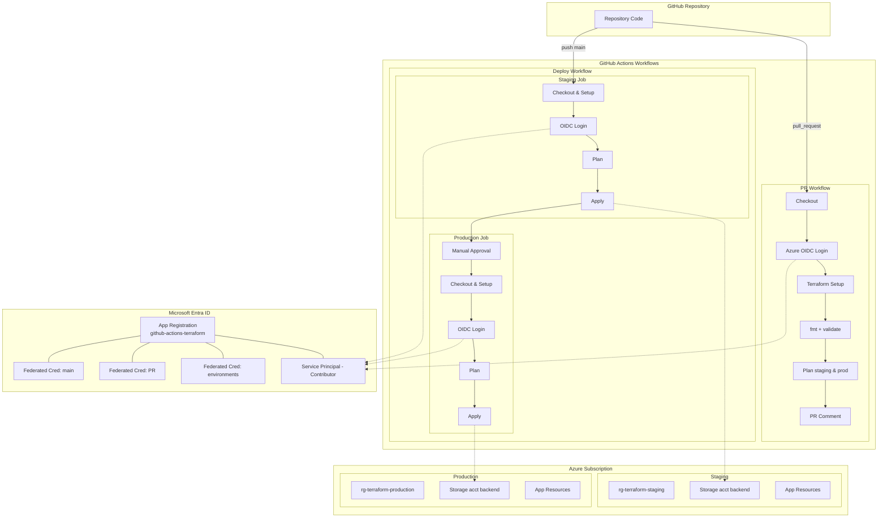

## Lab 4: Secure Multi-Environment Terraform Delivery with GitHub Actions

Build a PR → staging → production Terraform pipeline using GitHub Actions + Azure OIDC (no static credentials) with environment separation, promotion controls, and extensibility hooks.

---

## 1. Learning Objectives
By the end you will be able to:
* Use GitHub OIDC to authenticate Terraform in CI without stored secrets
* Structure dual-environment (staging/production) Terraform with minimal duplication
* Surface Terraform plan feedback automatically on Pull Requests
* Promote infrastructure changes safely through staged applies
* Prepare hooks for policy, security, cost, and drift automation

## 2. What You Will Build
Terraform configs (VNet, VM, NSG, optional monitoring) used as a realistic target for a secure delivery workflow.

Environment differences:

| Aspect | Staging | Production | Rationale |
|--------|---------|-----------|-----------|
| VM size | (smaller) e.g. Standard_B1s | Standard_D2s_v3 | Cost vs performance |
| Monitoring | Disabled | Enabled | Save cost in staging |
| Retention | Short | Longer | Compliance / forensics |
| Apply Mode | Auto after merge | Manual approval gate | Risk reduction |
| Scale (future) | Single | Expandable | Progressive hardening |

## 3. Architecture Overview


## 4. Prerequisites
* Azure subscription (rights to create RBAC role assignments + App Registrations)
* Logged in locally: `az login`
* GitHub CLI: `gh auth login`
* Terraform CLI
* Bash & OpenSSH client
* Environment variable: `GITHUB_REPO="<org>/<repo>"`
Optional:
* Separate subscription or clear naming to avoid collisions

## 5. Quick Start

### 5.1 Bootstrap
1. Export repo variable and run bootstrap:
   ```bash
   export GITHUB_REPO="<org>/<repo>"
   ./prepare.sh
   ```
2. Script creates: App Registration, federated credentials, storage accounts (staging/prod), GitHub environments, secrets.
3. Capture outputs (Client ID, Tenant ID, Subscription ID, storage account names) for reference.
4. Copy solutions/lab4/.github/workflows/lab4-plan.yml, lab4-apply.yml, lab4-destroy.yml to .github/workflows/.

### 5.1 Post-Bootstrap Governance
Immediately enforce controls:
* Branch protection on `main` (require PR + approvals, optionally dismiss stale reviews)
* Environment protection: reviewers for `staging` and stricter reviewers for `production`
* Optional: wait timer for production
* Optional: enable secret scanning / dependency alerts
* Validate: open a PR → plan comment appears; direct push to `main` blocked

### 5.2 Workflows Validation
1. Create a test branch from main and make a trivial change (e.g. outputs.tf).
2. Push branch and open a PR.
3. Verify that the plan comment appears in the PR.
4. Merge the PR and observe staging apply; approve production job to complete.

## 6. Repository Layout (Lab 4 Relevant)
```
solutions/lab4/
  main.tf
  outputs.tf
  production.tfvars
  staging.tfvars
  providers.tf
  variables.tf
  prepare.sh
  scripts/cloud-init.yml
```

## 7. Terraform Configuration Strategy
* Separate `*.tfvars` for environment-specific sizing & toggles
* Distinct remote state backends (one per environment) created by bootstrap
* Conditional monitoring (enabled only when production flag set)
* Tagging strategy for traceability (consider repo, environment, owner)

### 7.1 Backend Pattern (Conceptual)
Each workflow step initializes with backend config referencing its env-specific storage account + key (`lab4.tfstate`).

### 7.2 Variables & Conditionals
Use boolean or string variables to enable production-only resources (monitoring, retention). Keep defaults safe & inexpensive.

## 8. CI/CD Workflows Summary
| Purpose | File | Trigger | Key Actions | Notes |
|---------|------|---------|-------------|-------|
| PR planning (both envs) | `.github/workflows/lab4-plan.yml` | pull_request, manual | fmt, validate, matrix plan, PR comment | Plans only |
| Staging → Production apply | `.github/workflows/lab4-apply.yml` | push to main, manual | staging plan/apply then prod (after approval) | Promotion chain |
| Selective destroy | `.github/workflows/lab4-destory.yml` | manual dispatch | confirm, plan-destroy, apply | Typo preserved intentionally |

## 9. Workflow Deep Dive
### 9.1 Plan Workflow (`lab4-plan.yml`)
* Matrix: `staging`, `production`
* Produces markdown summaries (`plan_summary_<env>.md`)
* Exit codes: 0=no change, 2=changes, 1=failure (job fails)
* Updates a single PR comment incrementally

### 9.2 Apply Workflow (`lab4-apply.yml`)
* Trigger: merge (push to main) or manual dispatch
* Staging auto-applies; Production waits for environment approval gate
* Artifacts: post-apply state snapshot + JSON outputs
* Optional health checks (extend here)

### 9.3 Destroy Workflow (`lab4-destory.yml`)
* Manual safety: requires confirmation string + environment selection
* Applies destroy only if plan exit code = 2
* Supports `all` ordering: staging then production

## 10. Security & Governance
| Control | Mechanism | Benefit |
|---------|----------|---------|
| AuthN | GitHub OIDC → Azure federated credentials | No long-lived secrets |
| AuthZ | SP with least-required role (Contributor / scoped RG) | Blast radius reduction |
| Branch Protection | GitHub branch rules | Prevent bypassing review |
| Environment Protection | GitHub environments + reviewers | Manual gate for prod |
| Future Policies | tfsec/checkov/OPA/Conftest | Early failure of non-compliance |

## 11. Cost & Optimization
Integrate Infracost in PR workflow to annotate plan with delta cost. Potential policy: block when % or absolute increase > threshold.

## 12. Troubleshooting
| Symptom | Likely Cause | Fix |
|---------|--------------|-----|
| OIDC login fails | Federated credential mismatch | Check subject format matches repo + ref |
| No PR plan comment | Missing permissions | Add `pull-requests: write` under workflow permissions |
| Plan exit code 1 | Syntax/validation error | Inspect validate/plan logs earlier in job |
| State lock stuck | Previous job aborted | Use `terraform force-unlock <lock-id>` cautiously |
| Production job skipped | Env approval pending | Approve in GitHub Environments UI |

## 13. Cleanup
Automated:
* Run destroy workflow (choose environment, confirm)

## 14. Extension Ideas
* Add tfsec / checkov security scan to PR workflow
* Integrate Infracost cost delta + threshold enforcement
* Drift detection scheduled plan (cron)
* Export plan JSON → OPA policy evaluation
* ChatOps notifications (Teams/Slack) on apply result
* Automated tagging enrichment (Git commit SHA, PR number)

## 15. Review Questions
1. How will you enforce policy (tag, security, cost) gates pre-merge?
2. What criteria justify automatic vs manual production deployment?
3. How can backend + var selection be standardized (composite actions / scripts)?
4. Where do you centralize reusable workflow templates?
5. How do you surface drift or failed applies to stakeholders?
6. Which additional scanners fit your compliance posture?
7. How would you block unexpectedly expensive changes with cost data?

## 16. Reference Links
* Terraform Conditionals: https://developer.hashicorp.com/terraform/language/expressions/conditionals
* Terraform Variables & Validation: https://developer.hashicorp.com/terraform/language/values/variables
* AzureRM Provider (linux VM): https://registry.terraform.io/providers/hashicorp/azurerm/latest/docs/resources/linux_virtual_machine
* Azure AD OIDC for GitHub: https://learn.microsoft.com/azure/developer/github/connect-from-azure
* Log Analytics Workspace: https://learn.microsoft.com/azure/azure-monitor/logs/log-analytics-workspace-overview
* Azure Virtual Network Overview: https://learn.microsoft.com/azure/virtual-network/virtual-networks-overview