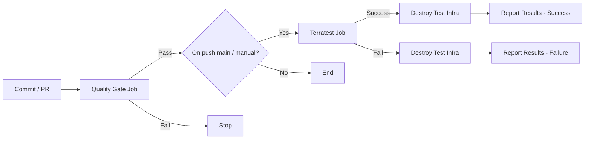

## Lab 5 – Terraform Quality Gate, Azure OIDC, and Terratest

Add a layered quality + security + test pipeline for Terraform modules using Azure OIDC (no static secrets) and Terratest integration tests.

---

## 1. Learning Objectives
* Authenticate to Azure with GitHub OIDC (no client secret)
* Enforce style, validation, lint, and security scanning before integration tests
* Gate merges by configurable vulnerability severity
* Run Terratest to provision, verify, and tear down Azure infra
* Tune thresholds and extend to more environments safely

## 2. Pipeline Flow Overview

Quality Gate layers (sequential): fmt → validate → TFLint → Checkov (severity gate). Terratest runs only if the quality gate passes (and only on push/workflow_dispatch, not on PR if so configured).

## 3. What This Lab Focuses On
| Area | Tool / Mechanism | Purpose | Failure Impact |
|------|------------------|---------|----------------|
| Formatting | terraform fmt -check | Consistent style | Usually blocks until fixed |
| Validation | terraform validate | Syntax & internal refs | Hard fail |
| Lint | TFLint | Best practices / provider issues | Hard fail (configurable) |
| Security / Misconfig | Checkov | Policy & misconfig scan | Severity‑based fail |
| Integration | Terratest (Go) | Provision + assertions + destroy | Hard fail on test errors |
| Auth | GitHub OIDC → Azure | Ephemeral credentials | Fail prevents any cloud access |

## 4. Repository Layout (Lab 5)
```
solutions/lab5/
   README.md
   prepare.sh
   modules/
      web_app/
         main.tf
         variables.tf
         outputs.tf
         versions.tf
   examples/
      basic/
         main.tf
   tests/
      go.mod
      web_app_test.go
   tflint-fails/
      main.tf
      version.tf
```

## 5. Prerequisites
| Requirement | Details |
|-------------|---------|
| Azure Role | Owner or User Access Administrator (to assign Contributor) |
| Local Tools | az, gh, bash, terraform, go (for Terratest) |
| Auth | `az login`, `gh auth login` |
| Env Vars | `GITHUB_REPO=org/repo`, optional `APP_NAME` (default github-terraform-cicd) |
| Network | Access to Azure AD + GitHub APIs |
| Permissions | Create App Registration, Federated Credential, Role Assignment, GitHub env + secrets |

## 6. Quick Start
```bash
git clone <repo>
cd terraform-advanced-workshop/solutions/lab5
export GITHUB_REPO="<org>/<repo>"
# optional
export APP_NAME="github-terraform-cicd"
./prepare.sh
```
Script actions:
* Create / reuse App Registration + Service Principal
* Add federated credential (subject: repo:ORG/REPO:environment:development)
* Assign Contributor on subscription
* Ensure GitHub environment `development` with secrets: AZURE_CLIENT_ID / AZURE_TENANT_ID / AZURE_SUBSCRIPTION_ID

Verify (optional):
```bash
az ad app show --id "$APP_NAME" --query '{appId:appId, displayName:displayName}'
az role assignment list --assignee "$(az ad app show --id "$APP_NAME" --query appId -o tsv)" --query '[].roleDefinitionName'
```

## 7. Detailed Pipeline Stages
### 7.1 Quality Gate Job
Order of operations:
1. terraform fmt -check (module + example)
2. terraform init / validate (module + example)
3. TFLint (module + example + separate failing sample dir for illustration)
4. Checkov scan (produces SARIF + JUnit artifacts)
5. Severity evaluation → fail if any >= threshold

Artifacts: `checkov-results` (SARIF/JUnit), potential summary markdown.

### 7.2 Severity Gating Logic
Pseudo-rule:
```
if highestFindingSeverity >= CHECKOV_SEVERITY_THRESHOLD then fail
```
Common thresholds:
| Threshold | Blocks Severities |
|-----------|------------------|
| LOW | LOW+ |
| MEDIUM | MEDIUM+ |
| HIGH | HIGH+ |
| CRITICAL | CRITICAL only |

### 7.3 Terratest Job
Runs after quality gate (and only on configured triggers):
* go mod tidy / download
* go test -v -timeout 30m ./tests
* Test provisions infra via Terraform, asserts outputs, then destroys
* Failing test ensures resources are still cleaned via deferred destroy

## 8. Configuration & Tuning
| Variable | Location | Purpose | Example |
|----------|----------|---------|---------|
| GITHUB_REPO | shell env | Identify repo for bootstrap | org/repo |
| APP_NAME | shell env | Override app registration name | lab5-oidc-app |
| CHECKOV_SEVERITY_THRESHOLD | workflow env | Set fail threshold | MEDIUM |
| TF_LOG | optional env | Terraform debug logging | INFO |
| GO_TEST_TIMEOUT | workflow param | Adjust test runtime limit | 30m |

Add new federated environment: replicate credential creation in `prepare.sh` with subject pattern `repo:ORG/REPO:environment:<name>` and create GitHub environment `<name>` with same secrets.

## 9. Federated Identity & Security Model
| Aspect | Current | Improvement Path |
|--------|---------|------------------|
| Scope | Subscription Contributor | Narrow to RG or specific roles |
| Credential Lifetime | Ephemeral OIDC token | Maintain minimal audience + claims |
| Secret Storage | None (OIDC only) | Keep it secretless; audit usage |
| Policy | Reactive (Checkov scan) | Add proactive OPA / Conftest gate |

## 10. Local Development
Format & lint locally:
```bash
terraform -chdir=modules/web_app fmt -check
terraform -chdir=modules/web_app init -backend=false
terraform -chdir=modules/web_app validate
tflint modules/web_app
```
Run example plan:
```bash
terraform -chdir=examples/basic init -backend=false
terraform -chdir=examples/basic plan
```
Run Terratest locally (requires Azure auth):
```bash
cd tests
go test -v -timeout 30m
```

## 11. Troubleshooting
| Symptom | Likely Cause | Resolution |
|---------|--------------|------------|
| OIDC auth failure | Federated subject mismatch | Re-run bootstrap; verify subject string in portal |
| Checkov always fails | Threshold too low or real findings | Raise threshold or remediate findings |
| Terratest timeout | Long Azure provisioning | Increase timeout or optimize resources |
| Lint warnings ignored | TFLint not configured to fail | Enable failure on warnings via config |
| Residual resources after fail | Destroy step skipped | Run `terraform destroy` manually in test workspace |

## 12. Extending the Pipeline
* Parallelize lint + security using matrix or separate jobs
* Add tfsec or Trivy config scanning for redundancy
* Add Infracost for cost delta gating
* OPA/Conftest evaluation on `terraform plan -json` output
* Nightly drift detection plan + notification (Slack/Teams)
* Upload test coverage of helper Go code if expanded

## 13. Cleanup
No persistent infra should remain after Terratest. If debugging leaves resources:
```bash
terraform -chdir=tests/fixtures/web_app destroy
```
Or manually locate RG created by tests (naming pattern inside test code) and remove via Azure CLI.

## 14. Review Questions
1. Which pipeline stages are most cost‑effective to fail early? Why?  
2. How would you refactor to least privilege (role + scope)?  
3. How do you prevent “severity inflation” (ignoring too many warnings)?  
4. What’s the tradeoff of running Terratest on every PR vs only main?  
5. How could you persist sanitized plan JSON for external policy evaluation?  
6. Which metrics (MTTR for failures, vulnerability trend) would you dashboard?  
7. How would you enforce time-boxed remediation for HIGH findings?  

## 15. Reference Links
* Terraform CLI: https://developer.hashicorp.com/terraform/cli
* TFLint: https://github.com/terraform-linters/tflint
* Checkov: https://www.checkov.io
* Terratest: https://terratest.gruntwork.io
* GitHub OIDC hardening: https://docs.github.com/actions/deployment/security-hardening-your-deployments/about-security-hardening-with-openid-connect
* Azure federated credentials: https://learn.microsoft.com/azure/active-directory/develop/workload-identity-federation
* SARIF Viewer VS Code: https://marketplace.visualstudio.com/items?itemName=MS-SarifVSCode.sarif-viewer
